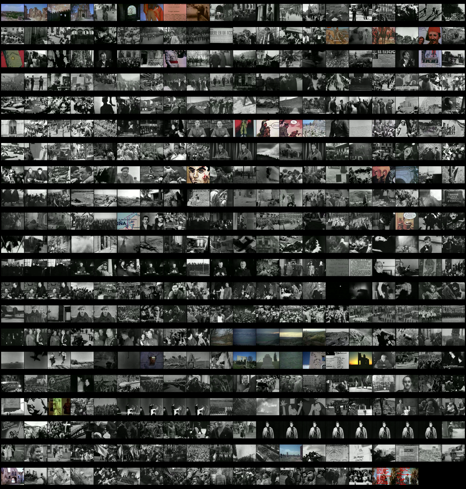
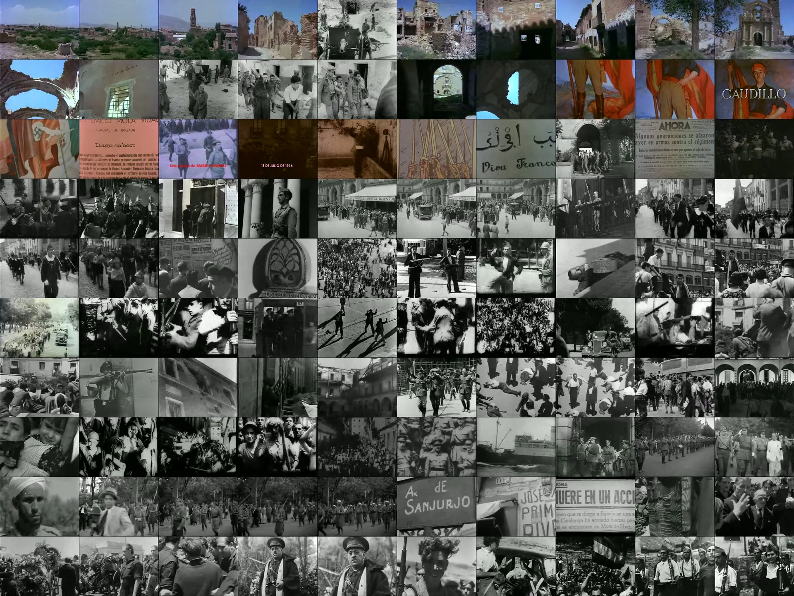
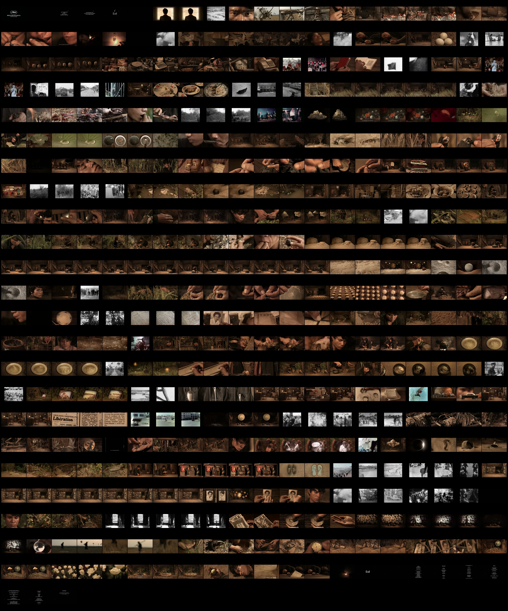
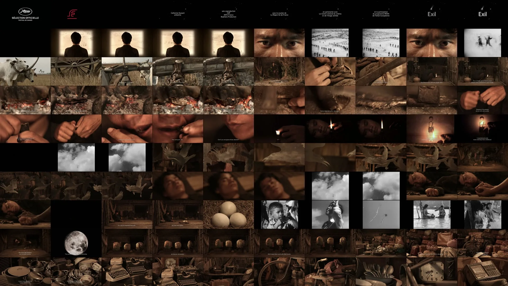
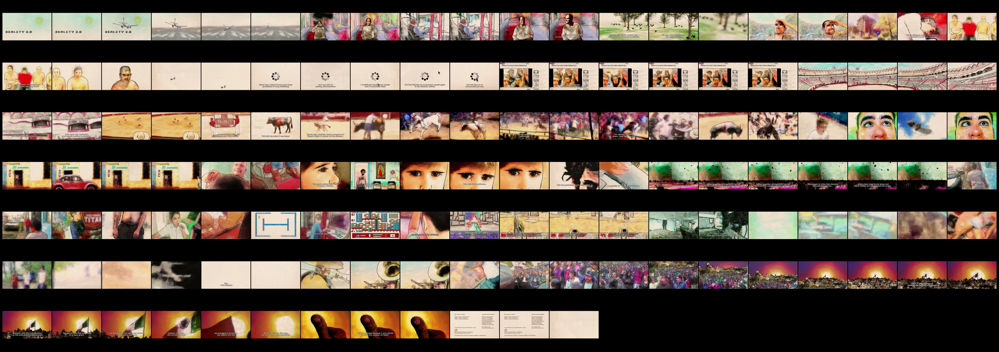
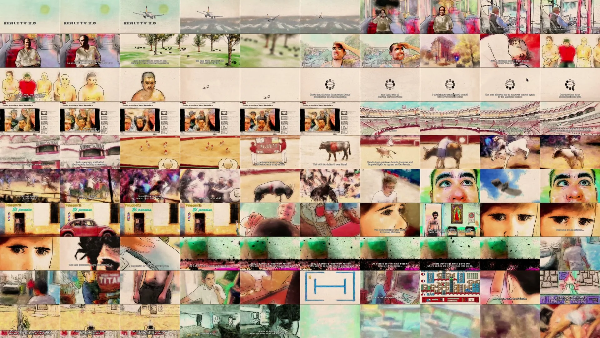

GORGON EYE: Photogrammatic Analysis Tools 👁️

Official repository of the methodological scripts developed for the GORGON Atlas project, dedicated to the programmatic extraction of frames and the generation of original analytical instruments: the filmic dynamogram and the spectrogram.

This methodology engages with Aby Warburg's iconological tradition and Walter Benjamin's philosophy of the dialectical image, transposing that visual and spectral heritage into the contemporary analysis of the moving image. The Dynamogram recovers Aby Warburg's notion of "energetic trace," while the Spectrogram applies Walter Benjamin's "spectral analysis" (Spektralanalyse).


---

Cite this software:
Hachero, B. (2026). Gorgon Eye: Photogrammatic Atlas Toolkit (v1.0.0). Zenodo. https://doi.org/10.5281/zenodo.19426974

---

## 🖼️ Results: The Photogrammatic Constellation

The scripts generate representations that operate at two fundamental scales of visual analysis: chromatic condensation (spectrogram) and gestural unfolding (dynamogram).

| Proyect | Spectrogram (Macro scale) | Dinamogram (Analytic scale) |
| :--- | :--- | :--- |
| **Caudillo** |  |  |
| **Exile** |  |  |
| **Reality 20** |  |  |

> **Methodological note:** The dynamograms shown here represent the first sheet of a technical series. This device allows navigation through the Pathosformel and the survival of forms across the entire filmic fabric.

---

## 🎞️ Basic Workflow

The system is designed so that the scripts "travels" according to the stage of the process you are at:

1. **Extraction:** 📸
   - Place the `extractor.bat` script in the folder where your video is located.
   - Double-click it. The script will automatically create a folder called **`FRAMES_GEN`** where all extracted frames will be saved (one every 5 seconds by default).

2. **Corpus Preparation:** 📂
   - Open the **`FRAMES_GEN`** folder.
   - **Copy or move** the generator scripts (`generate_dinamogram.bat` o `generate_espectrogram.bat`) **into** into this folder, alongside the images.

3. **Weaving the Constellation:** 🕸️
   - Run the chosen generator from within **`FRAMES_GEN`**.
   - The script will automatically detect all frames and produce the **dynamogram** (across several sequential sheets) or the **spectrogram** (as a single condensed image).

---

## 📁 Repository Structure

* **`/v1_Windows_BAT`**: Native executable scripts for Windows (`.bat`). The most accessible version: double-click and done.
* **`/v2_Python_Scripts`**: Advanced scripts (`.py`). They offer greater flexibility, support for formats such as WebP, and control over aspect ratio normalization.

---

## License

This project is licensed under the **AGPL-3.0** for open source use.

For commercial use without open-sourcing your code, a **commercial license** 
is available. Contact [bhachero@us.es](mailto:bhachero@us.es) for pricing.

---

### ⚙️ System Requirements

For the scripts to function correctly, the following components are required:

FFmpeg (Required): This is the processing engine for all scripts.

It must be installed and configured in the system PATH.
Alternative: Place the `ffmpeg.exe` executable directly in the same folder as the scripts.
Download it at ffmpeg.org.

Python 3.8+: Required only for running the tools in the `/v2_Python` folder.

3.  **Python Dependencies**:
    * **Pillow (>=10.0.0)**: Used for advanced image manipulation and compositing in the spectrogram generator.
    * **Installation**: `pip install -r requirements.txt`. 

## 🚀 Installation (Python Version)

```bash
git clone [https://github.com/bhachero/gorgon-eye.git](https://github.com/bhachero/gorgon-eye.git)
cd gorgon-eye
pip install -r requirements.txt

